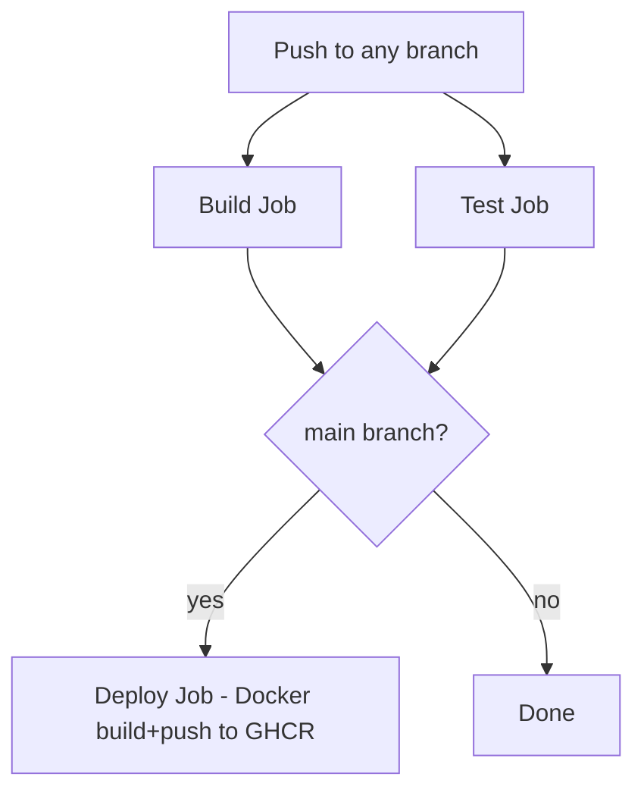

# Java Spring Boot Template - Implementation Plan

## Goal

Create a Backstage scaffolder template that generates a Java 21 Spring Boot project with Gradle, pushes it to GitHub, includes a CI/CD pipeline (build, test, Docker deploy to GHCR), and registers the component in the Backstage catalog. Wire up the GitHub Actions plugin so the CI/CD tab shows real pipeline status.

## Architecture Overview


## File Structure - New Template

All new files go under `examples/spring-boot-template/`:

```
examples/spring-boot-template/
  template.yaml                          # Scaffolder template definition
  content/
    catalog-info.yaml                    # Backstage catalog descriptor
    build.gradle                         # Gradle build file
    settings.gradle                      # Gradle settings
    gradlew                              # Gradle wrapper script
    gradlew.bat                          # Gradle wrapper script for Windows
    gradle/
      wrapper/
        gradle-wrapper.properties        # Gradle wrapper config
    Dockerfile                           # Multi-stage Docker build
    .gitignore                           # Java/Gradle gitignore
    README.md                            # Project README
    .github/
      workflows/
        ci-cd.yml                        # GitHub Actions pipeline
    src/
      main/
        java/
          ${{values.javaPackageDir}}/
            Application.java             # Spring Boot main class
            controller/
              HealthController.java      # Health check REST endpoint
        resources/
          application.yml                # Spring config
      test/
        java/
          ${{values.javaPackageDir}}/
            ApplicationTests.java        # Spring Boot test
```

## Template Parameters - Wizard Form

The template.yaml will collect these from the user:

| Parameter | Type | Required | Description |
|-----------|------|----------|-------------|
| name | string | yes | Component name, e.g. my-service |
| description | string | yes | Short description |
| owner | string | yes | Owner group/user entity ref |
| javaPackage | string | yes | Java package, e.g. com.example.myservice |
| springBootVersion | enum | yes | 3.4.x or 3.3.x |
| repoUrl | RepoUrlPicker | yes | GitHub repo location |

The `javaPackageDir` value will be derived from `javaPackage` by replacing dots with slashes (e.g. `com.example.myservice` becomes `com/example/myservice`). This uses a Nunjucks filter in the template.

## Scaffolder Steps

1. **fetch:template** - Copy skeleton from `./content`, apply Nunjucks templating
2. **publish:github** - Create GitHub repo with the rendered content
3. **catalog:register** - Register the new component in Backstage catalog
4. **notification:send** - Notify the user that creation is complete

## CI/CD Pipeline - GitHub Actions Workflow

The `.github/workflows/ci-cd.yml` will have three jobs:

### Build Job
- Checkout code
- Set up Java 21 with Gradle
- Run `./gradlew build`
- Cache Gradle dependencies

### Test Job
- Checkout code
- Set up Java 21
- Run `./gradlew test`
- Publish JUnit test results

### Deploy Job (on main branch push only)
- Checkout code
- Log in to GitHub Container Registry
- Build Docker image
- Push to `ghcr.io/${{ github.repository }}`
- Tag with commit SHA and `latest`



## Backstage Frontend Changes

### Install GitHub Actions Plugin

Package: `@backstage-community/plugin-github-actions`

Add to `packages/app/package.json` dependencies.

### Update EntityPage.tsx

Replace the EmptyState CI/CD placeholder (lines 69-97) with the GitHub Actions content:

```tsx
import {
  EntityGithubActionsContent,
  isGithubActionsAvailable,
} from '@backstage-community/plugin-github-actions';

const cicdContent = (
  <EntitySwitch>
    <EntitySwitch.Case if={isGithubActionsAvailable}>
      <EntityGithubActionsContent />
    </EntitySwitch.Case>
    <EntitySwitch.Case>
      <EmptyState
        title="No CI/CD available for this entity"
        missing="info"
        description="Add the github.com/project-slug annotation to enable CI/CD."
      />
    </EntitySwitch.Case>
  </EntitySwitch>
);
```

## Backstage Backend Changes

No backend changes needed. The GitHub Actions plugin is frontend-only. It reads data through the existing GitHub integration (GITHUB_TOKEN proxy).

## Configuration Changes

### app-config.yaml

Add the new template to catalog locations:

```yaml
catalog:
  locations:
    # ... existing locations ...
    
    # Spring Boot template
    - type: file
      target: ../../examples/spring-boot-template/template.yaml
      rules:
        - allow: [Template]
```

## Template Content Details

### catalog-info.yaml
- `github.com/project-slug` annotation set from repo URL (enables GitHub Actions plugin)
- Component type: service
- Lifecycle: experimental

### build.gradle
- Spring Boot 3.4.x with Gradle
- Java 21 toolchain
- Dependencies: spring-boot-starter-web, spring-boot-starter-actuator, spring-boot-starter-test
- JUnit 5

### Dockerfile
- Multi-stage: build with Gradle image, run with Eclipse Temurin 21 JRE slim
- Exposes port 8080

### application.yml
- Server port 8080
- Actuator health endpoint enabled at /actuator/health

## Execution Order

1. Create `examples/spring-boot-template/content/` skeleton files (all the Java/Gradle/Docker content)
2. Create `examples/spring-boot-template/template.yaml` (scaffolder definition)
3. Add template location to `app-config.yaml`
4. Install `@backstage-community/plugin-github-actions` in frontend package
5. Update `EntityPage.tsx` to wire up GitHub Actions in CI/CD tab
6. Test the full flow locally with `yarn start`
7. Update memory bank files

## Risks and Open Questions

- The Nunjucks `replace` filter is needed to convert Java package dots to directory slashes. The scaffolder supports this natively.
- Gradle wrapper binaries (gradle-wrapper.jar) are binary files. Two options: include them in the template content, or have the CI/CD workflow run `gradle wrapper` as a setup step. Recommend including the wrapper properties file and letting CI use `gradle/gradle-build-action` which handles this.
- The GitHub Actions plugin needs the `github.com/project-slug` annotation on the catalog entity. The template's catalog-info.yaml must set this annotation using the repo URL parameter.
- GHCR push requires the repo's GITHUB_TOKEN to have `packages: write` permission. The workflow needs to declare this in its permissions block.
